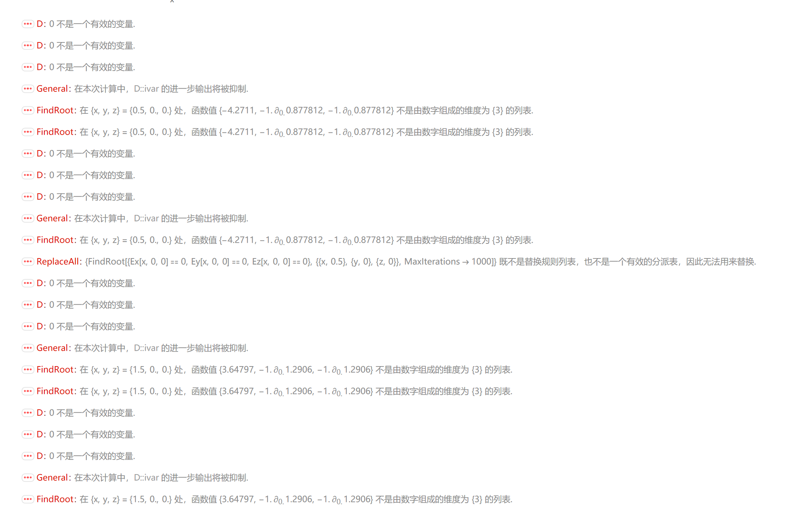
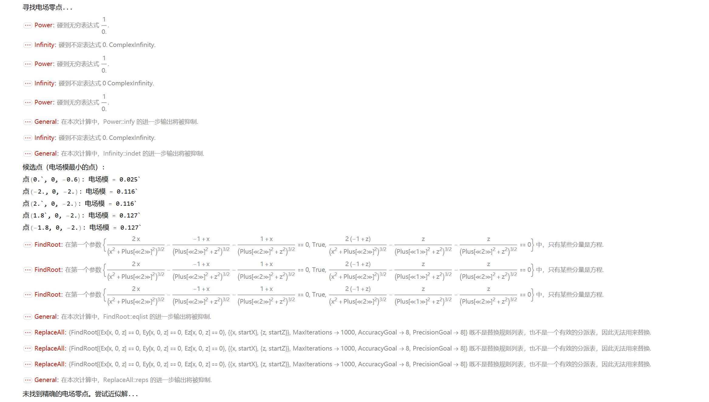

SetDelayed::write: E[x_,y_,z_] 中的标签 E 被保护.
报错后重新回炉重造
将受保护的 E 替换为自定义的 Efield，并优化了部分代码的可读性和鲁棒性

1

接下来报错是电场分量函数的定义未彻底 “符号化”，导致FindRoot无法识别有效的数值函数
修正逻辑说明
拆分电场分量：将电场的 x/y/z 分量分别定义为E_x/E_y/E_z，直接通过D[]求偏导，避免符号嵌套；
显式函数形式：E_z_zaxis[z]是仅关于z的显式函数，FindRoot可直接识别其数值形式；
避免符号冲突：彻底清空全局变量后重新定义，确保函数无残留符号干扰。

2

因为函数名包含了 Mathematica 的内置符号（如Times）

3
FindRoot::cvmit
输出存在电场零点数值异常（z≈7.3×10¹²），原因是FindRoot的初始猜测不合理，导致迭代发散。
解决方案
改用完全数值化的函数定义

4

回退至上一版
综合处理后，目前只有电场零点，计算有误，需要进一步分析原因

5
使用deep seek在豆包的基础上进行更改
出现大量报错，现在重新进行更改

在 FindRoot 中，变量应该是 {x, 0.5}, {y, 0}, {z, 0}，但代码中写成了 {{x, 0.5}, {y, 0}, {z, 0}}（多了一层括号）Ex[x, 0, 0] 等函数定义可能有问题，因为它们是延迟定义的
应该在调用 FindRoot 之前确保函数已经正确定义

主要修正：
直接计算电场分量：避免了使用 D 函数可能带来的问题
修正 FindRoot 语法：使用正确的变量列表格式
增加扫描步骤：先在网格上寻找候选点，再用 FindRoot 精确定位
处理对称性：利用系统在xz平面对称的特点（y=0）
增加容错处理：使用 Quiet 和条件检查

6

符号混淆：代码中使用了 k 作为变量，但它已经被定义为常数 k = 1
FindRoot 参数错误：在 FindRoot 中使用了 = 而不是 ==
变量名不匹配：代码中使用了 Etx 等未定义的函数名
数组索引错误：在计算 Hessian 矩阵时索引有误
主要修正：
将 k 改为 k0：避免与变量冲突
修正 FindRoot 语法错误：使用正确的方程格式
简化寻找平衡点的方法：
首先在 x 轴上寻找（利用对称性）
使用 NSolve 直接解方程
使用 FindMinimum 作为备选方案
移除有问题的 Hessian 计算：改用微扰测试分析稳定性
增加详细的稳定性分析：基于恩肖定理

7
在电荷位置处求值：当 x = ±1, y=0, z=0 时，正好在电荷位置上，导致除以零
语法错误：输出信息显示有语法问题
平衡点判断：真正的平衡点应该在电荷之间的某个位置，而不是在电荷位置上

8
其他程序运行正常，但是仍然没有找到电场零点
鉴于电场零点是之前所有程序的报错重点之一，独立另外一个文件用于计算电场零件

9
Plot 函数错误：PlotTitle选项的语法错误（Mathematica 中字符串需用双引号包裹，且选项符号应为->而非→），导致绘图失败。
FindRoot 不收敛：初值选择不合理（或方程存在多解），导致迭代 100 次后未收敛到正确的零点，最终输出了无物理意义的极大值（
z≈4.18×10 
12
 