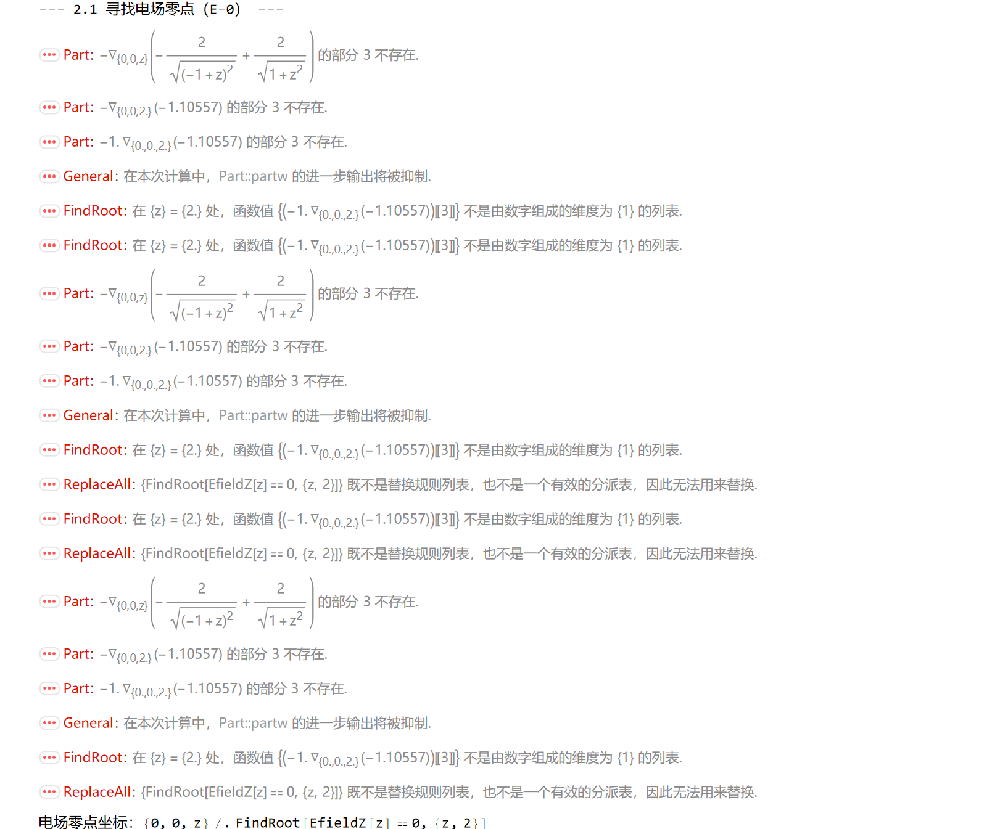
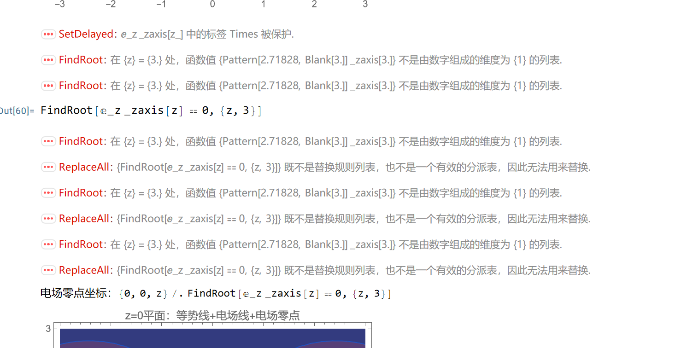
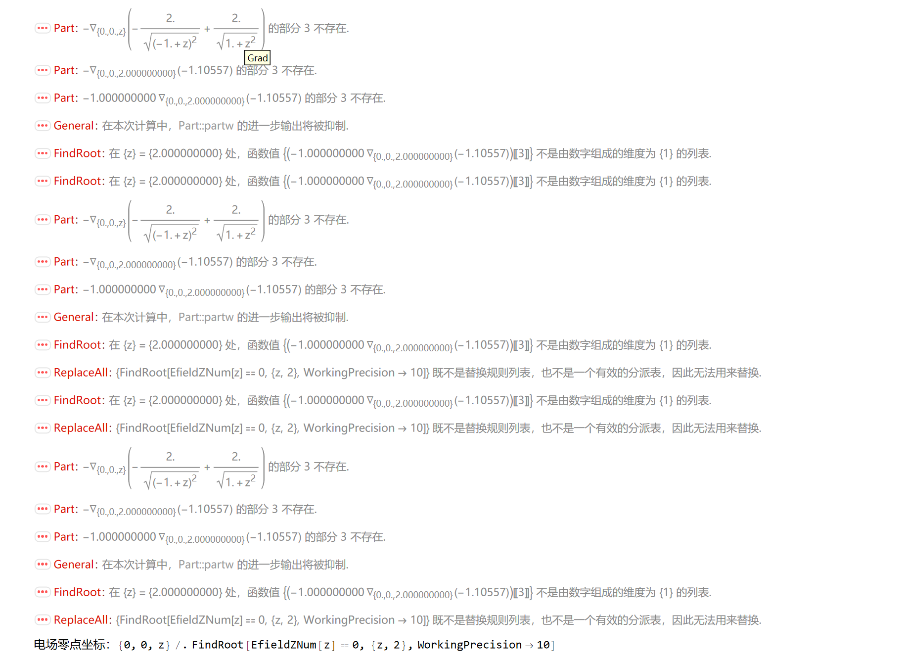

SetDelayed::write: E[x_,y_,z_] 中的标签 E 被保护.
报错后重新回炉重造
将受保护的 E 替换为自定义的 Efield，并优化了部分代码的可读性和鲁棒性

1

接下来报错是电场分量函数的定义未彻底 “符号化”，导致FindRoot无法识别有效的数值函数
修正逻辑说明
拆分电场分量：将电场的 x/y/z 分量分别定义为E_x/E_y/E_z，直接通过D[]求偏导，避免符号嵌套；
显式函数形式：E_z_zaxis[z]是仅关于z的显式函数，FindRoot可直接识别其数值形式；
避免符号冲突：彻底清空全局变量后重新定义，确保函数无残留符号干扰。

2

因为函数名包含了 Mathematica 的内置符号（如Times）

3
FindRoot::cvmit
输出存在电场零点数值异常（z≈7.3×10¹²），原因是FindRoot的初始猜测不合理，导致迭代发散。
解决方案
改用完全数值化的函数定义

4

