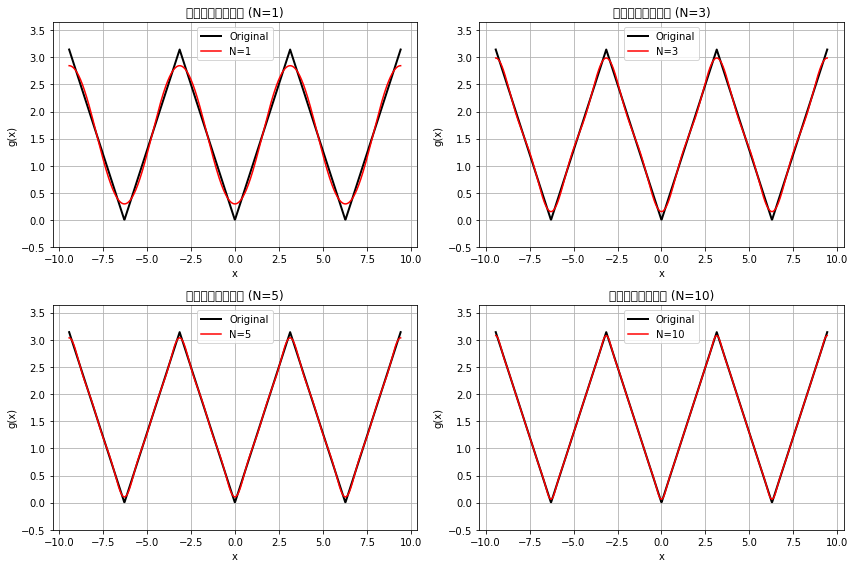

使用deep seek进行第一批编程

完成

收敛速度比较分析
三角波比方波收敛更快的原因：

函数光滑性：
三角波是连续函数（虽然在x=0处不可导）
方波有第一类间断点（跳跃间断）
函数越光滑，傅里叶系数衰减越快

系数衰减速率：
方波：衰减慢
三角波：衰减更快

吉布斯现象：
方波存在明显的吉布斯现象
角波没有吉布斯现象，收敛更均匀
数学解释：
根据傅里叶级数理论，函数的导数性质决定了系数衰减速度
三角波可以视为方波的积分结果，积分操作会提升光滑性