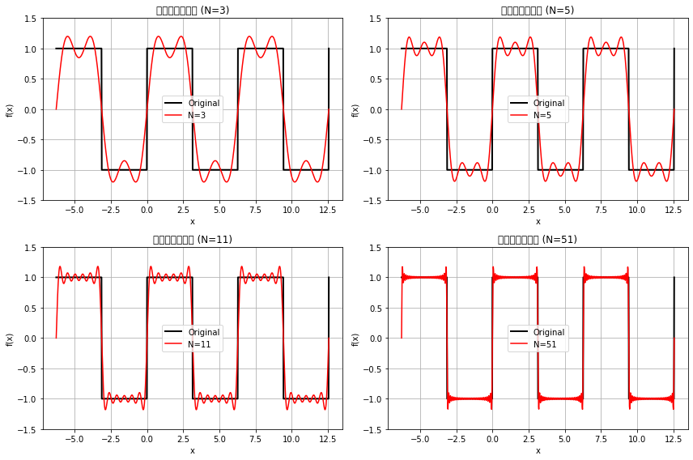

使用deep seek进行第一批编程

完成

吉布斯现象观察

吉布斯现象是指：
在间断点附近，傅里叶级数部分和会出现明显的过冲和振荡
随着项数N增加，振荡频率增加，但过冲的幅度不会减小
过冲量约为原始函数跳跃值的9%左右（对于方波，约为18%的过冲）
振荡区域宽度随N增大而减小，但最大过冲值趋于常数

从绘制的图像中可以清晰看到：
在x=π, 3π等间断点附近有明显的过冲
N越大，振荡越密集，但峰值高度基本不变
远离间断点的区域收敛效果更好