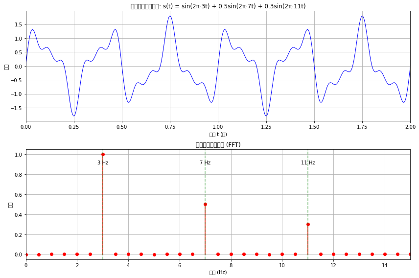

使用deep seek进行第一批编程

完成
结果分析

时域波形：
信号s(t)是由3Hz、7Hz和11Hz三个正弦波叠加而成
时域波形呈现复杂的周期性模式
由于频率成分不互质，合成信号的周期较长

频谱分析：
FFT结果清晰显示了3Hz、7Hz和11Hz三个频率峰
各频率分量幅度比约为1:0.5:0.3，与原始信号一致
验证了傅里叶变换的有效性

FFT原理：
快速傅里叶变换(FFT)是离散傅里叶变换(DFT)的高效算法
将时域信号变换到频域，揭示信号的频率组成
在信号处理、通信、音频分析等领域有广泛应用

吉布斯现象：在间断点附近，傅里叶级数部分和会出现过冲现象