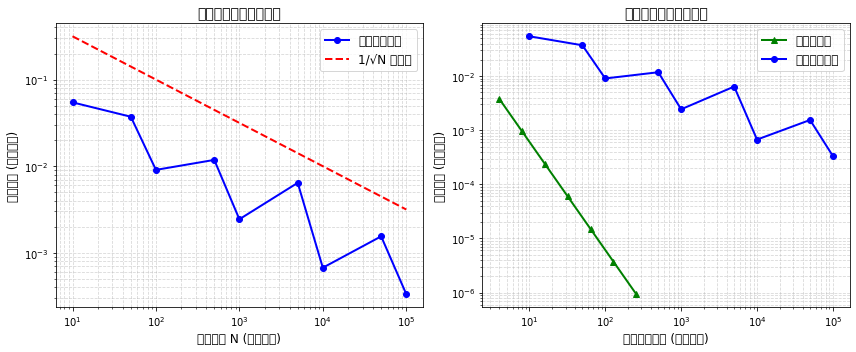

使用deep seek进行第一批编程

蒙特卡洛收敛速率分析:
N从10到50: 误差比=1.466, √N比=2.236, 比值接近1/√N: 0.344
N从50到100: 误差比=4.107, √N比=1.414, 比值接近1/√N: 1.904
N从100到500: 误差比=0.767, √N比=2.236, 比值接近1/√N: 0.657
N从500到1000: 误差比=4.843, √N比=1.414, 比值接近1/√N: 2.425
N从1000到5000: 误差比=0.380, √N比=2.236, 比值接近1/√N: 0.830
N从5000到10000: 误差比=9.553, √N比=1.414, 比值接近1/√N: 5.755
N从10000到50000: 误差比=0.434, √N比=2.236, 比值接近1/√N: 0.806
N从50000到100000: 误差比=4.646, √N比=1.414, 比值接近1/√N: 2.285

============================================================
方法比较与优缺点总结:
============================================================

1. 确定性方法（梯形法、Simpson法）:
   优点:
   - 收敛速度快（梯形法O(h²)，Simpson法O(h⁴))
   - 结果确定，可重复
   - 对一维问题非常高效
   缺点:
   - 维数灾难：高维时计算量指数增长
   - 对不规则区域处理困难

2. 蒙特卡洛方法:
   优点:
   - 维数无关：误差与1/√N成正比，与维度无关
   - 对复杂区域和积分容易实现
   - 天然适合并行计算
   缺点:
   - 收敛速度慢（1/√N）
   - 结果具有随机性，需要多次平均
   - 对于低维问题不如确定性方法高效

3. 适用场景:
   - 低维规则区域：使用确定性方法
   - 高维问题（>3维）：优先考虑蒙特卡洛方法
   - 复杂几何区域：蒙特卡洛方法更有优势
   - 需要快速近似：蒙特卡洛方法实现简单