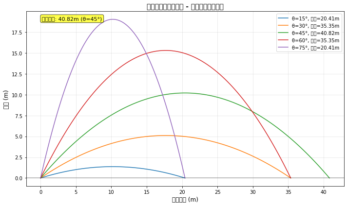
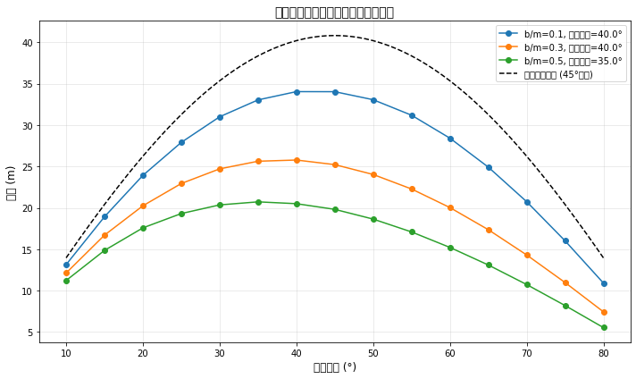
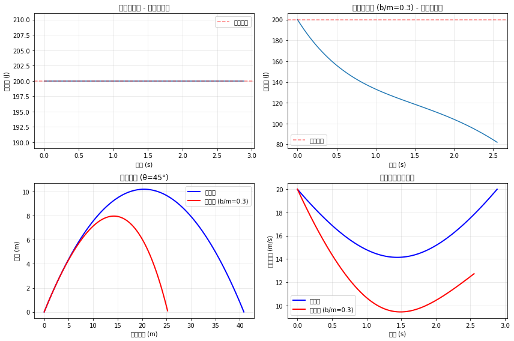

使用deep seek进行第一批编程

在代码中使用了 max_range_val 变量，但它只在一个函数内部定义，在全局作用域中不可用。让修复这个问题到test.py中

1. 有无空气阻力的物理差异：
   a) 轨迹形状：无阻力时轨迹为对称抛物线；有阻力时轨迹不对称，下降段更陡
   b) 射程：空气阻力显著减小射程
   c) 最大高度：空气阻力减小最大高度
   d) 飞行时间：空气阻力缩短飞行时间
   e) 能量：无阻力时机械能守恒；有阻力时机械能不守恒，能量逐渐耗散

2. 最佳发射角变化的原因：
   无阻力时，理论最佳发射角为45°，此时水平速度和竖直速度达到最优平衡
   有阻力时，最佳发射角小于45°。原因如下：
   a) 阻力与速度平方成正比（近似），水平速度越大，阻力越大
   b) 减小发射角可以减少水平速度分量，从而减小阻力影响
   c) 需要更多垂直分量来延长飞行时间，补偿水平方向的阻力损失

3. 数值结果总结：
   无阻力最大射程：40.82m (θ=45°)
   有阻力(b/m=0.3)时最大射程：25.78m (θ=40.0°)
   有阻力时射程减少：15.04m (36.8%)

==================================================
主要结论
==================================================
1. 无空气阻力时，45°发射角确实产生最大射程
2. 空气阻力使轨迹不对称，减小射程、高度和飞行时间
3. 随着阻力增加，最佳发射角从45°逐渐减小
4. 机械能在无阻力时守恒，在有阻力时逐渐耗散
5. 实际应用中需考虑空气阻力，最佳发射角通常小于45°

往里面添加了中文模块，这样子的图像可以加载中文标题和标签了