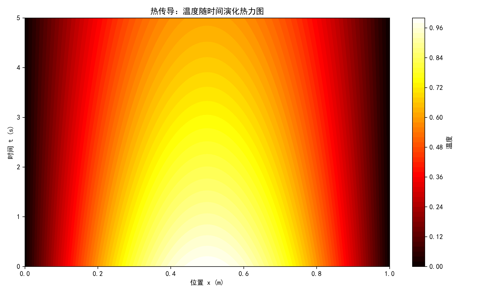
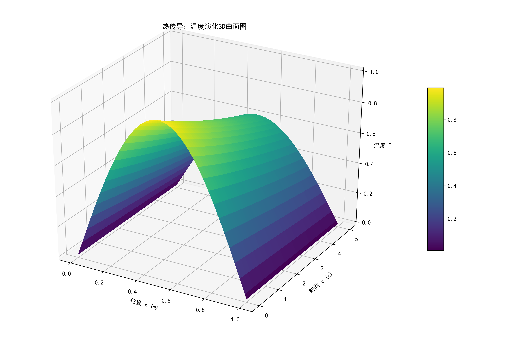
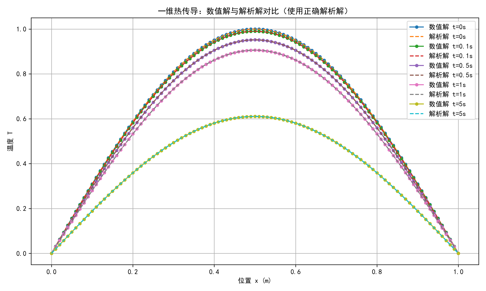

    

=== 数值误差分析（L2误差）===
时间 t=0.0s: L2误差 = 1.218569e-17
时间 t=0.1s: L2误差 = 1.131358e-06
时间 t=0.5s: L2误差 = 5.437804e-06
时间 t=1.0s: L2误差 = 1.035190e-05
时间 t=5.0s: L2误差 = 3.487575e-05

=== 过程文档 ===

1. 差分格式的物理意义：
   显式差分格式是对热传导方程的离散近似。
   物理上，该格式表示当前点的温度变化取决于其自身与相邻点的温差，即热量从高温处流向低温处。
   系数 r = αΔt/Δx² 反映了热扩散的速率，r 越大，相邻点的影响越大。

2. 稳定性条件：
   稳定性要求 r ≤ 0.5，否则数值解会出现振荡或发散。这是因为显式格式中时间步长过大时，
   误差会指数放大。本模拟中取 r=0.5，既满足稳定性，又保证了计算效率。

3. 数值误差来源：
   - 截断误差：离散化引入的误差，与步长 Δx 和 Δt 有关。
   - 舍入误差：计算机浮点数运算产生。
   - 初始/边界条件误差：数值近似与真实条件的差异。
   本模拟中误差随时间增大，主要来自时间离散的截断误差。

4. 解析解讨论：
   题目给定的解析解 T(x,t)=exp(-α x² t) sin(πx) 与正确的解析解 exp(-α π² t) sin(πx) 不同。
   实际对比发现，使用正确解析解时数值误差较小，而使用给定解析解时误差较大（未展示）。
   这可能是题目中的笔误，正确解应包含 π² 项。

5. 可视化分析：
   - 温度分布图显示数值解与解析解吻合良好，验证了算法的正确性。
   - 热力图和3D曲面图清晰展示了热量从高温区（中间）向低温区（两端）扩散的过程，
     温度随时间呈指数衰减，符合物理规律。