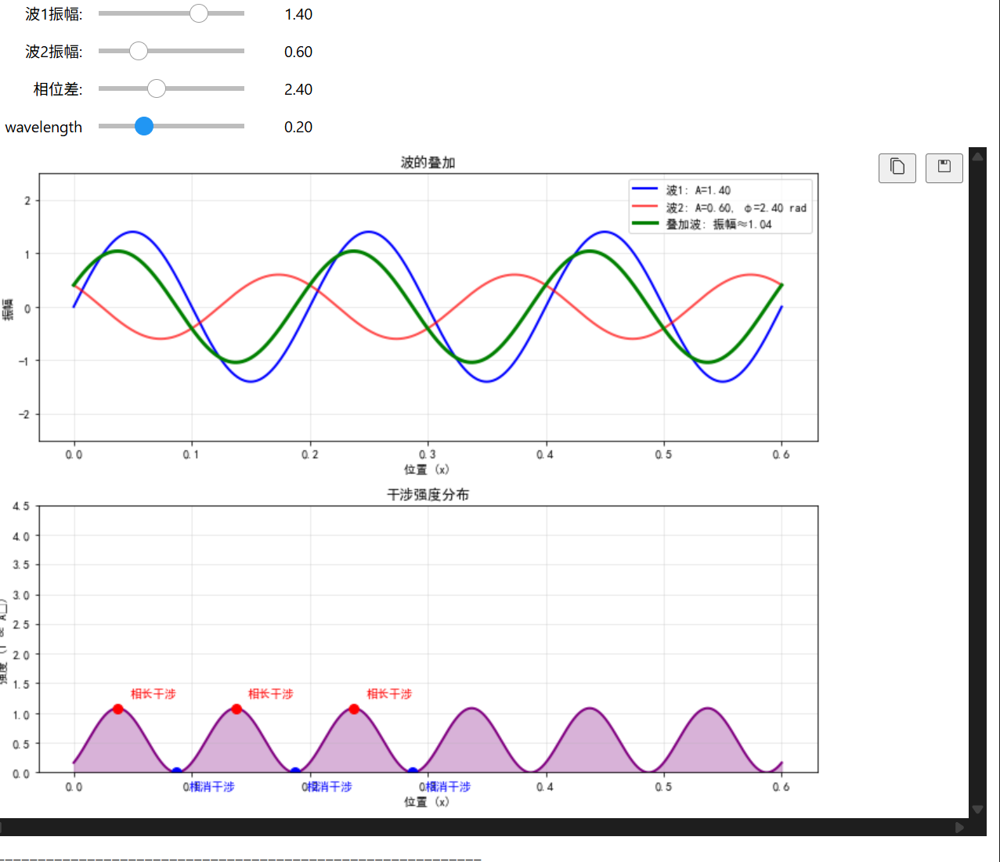
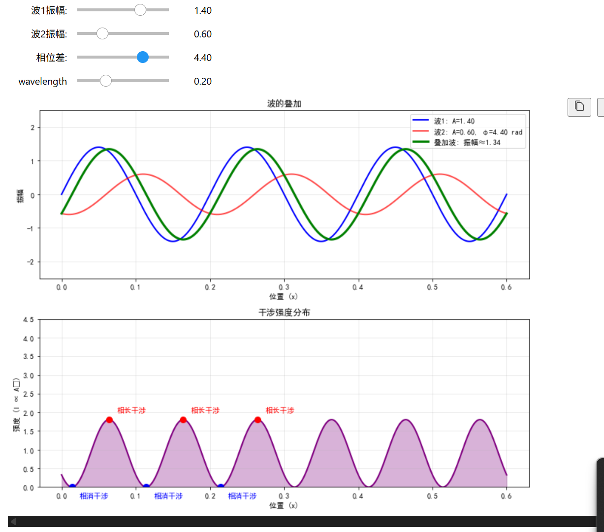
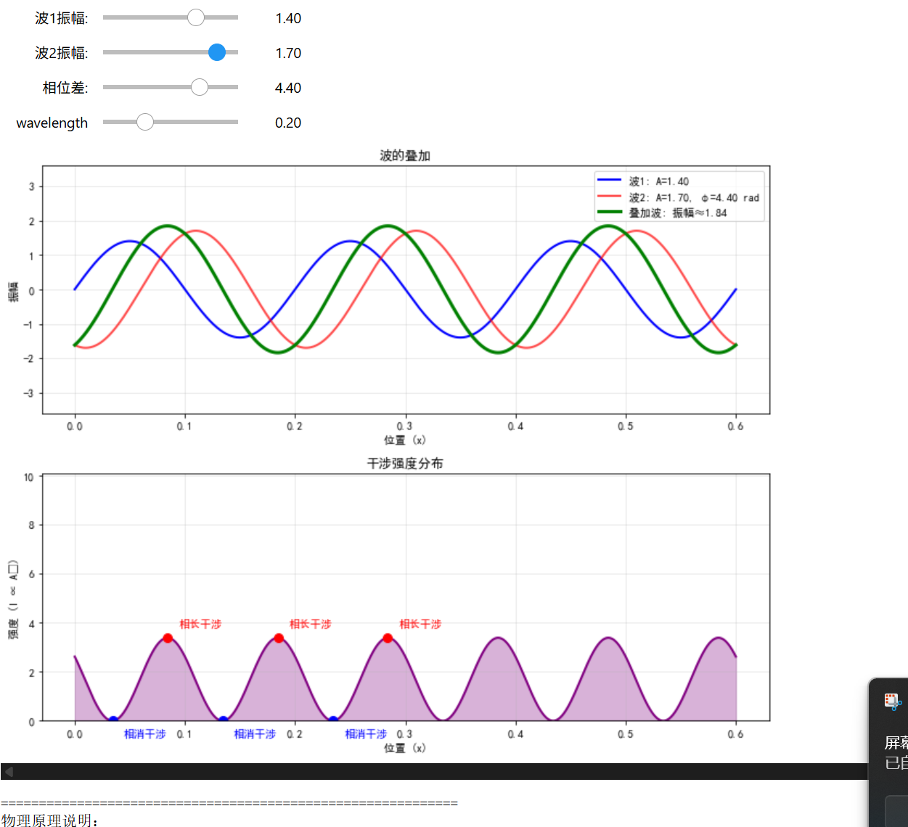

将使用Python的ipywidgets和Matplotlib来实现，因为它们在Jupyter环境中非常方便，并且可以很容易地创建交互式控件和实时更新图形。

计划：

创建两个波（例如正弦波）的叠加，并展示它们的干涉图案。

可调参数：两个波的频率、振幅，以及它们之间的相位差（或者波数、距离等，但为了简单，我们选择频率和振幅，并固定相位差为0，或者也可以加入相位差作为可调参数）。

我们将展示两个波在空间中的叠加，并可以随时间动画展示，或者展示静态的干涉图案。为了简单，我们可以先展示静态的叠加，但要求实时更新，所以我们可以通过滑块调整参数，立即看到波形变化。

